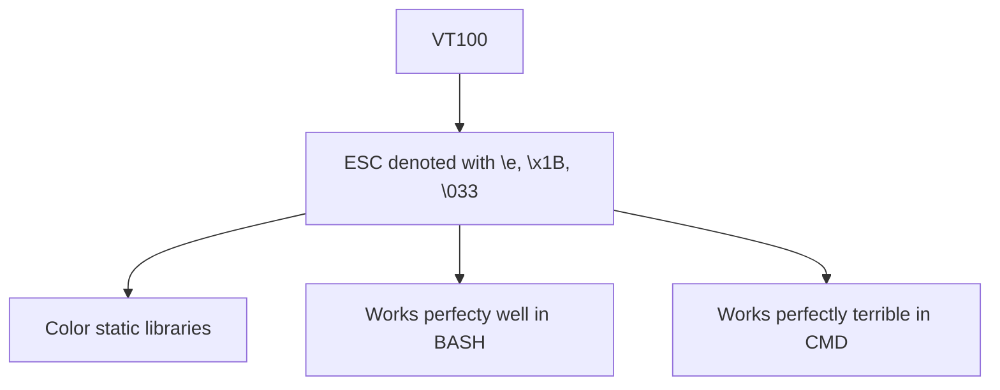

**Gitlab markdown codes**
https://docs.gitlab.com/ee/user/markdown.html

ANSI/VT100

[Description of VT100](https://misc.flogisoft.com/bash/tip_colors_and_formatting)
[Example of color representations](https://gist.github.com/Prakasaka/219fe5695beeb4d6311583e79933a009)

[Discussion on Win32 VT100 support](https://stackoverflow.com/questions/16755142/how-to-make-win32-console-recognize-ansi-vt100-escape-sequences)

[Example of implementing VT100 support on Windows 10 and higher](https://solarianprogrammer.com/2019/04/08/c-programming-ansi-escape-codes-windows-macos-linux-terminals/)

