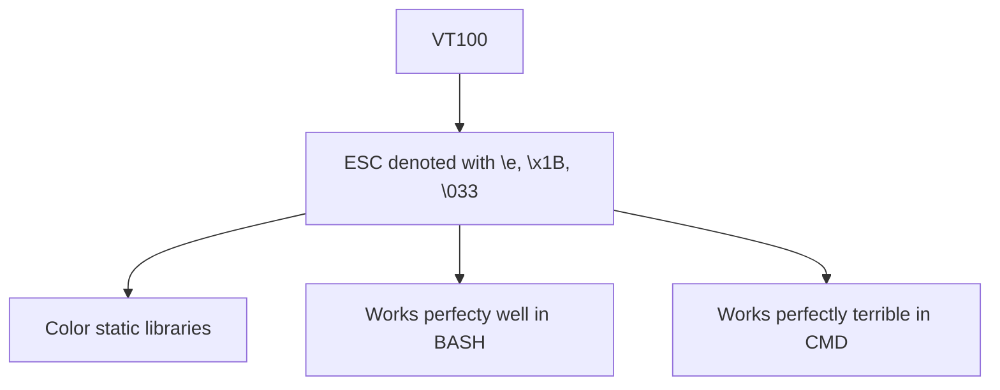

**Gitlab markdown codes**
https://docs.gitlab.com/ee/user/markdown.html

ANSI/VT100

```mermaid
graph TD;
  a[VT100]-->b[ESC denoted with \e, \x1B, \033];
  b-->b1[Color static libraries]
  b-->b2[Works perfecty well in BASH];
  b-->b3[Works perfectly terrible in CMD];
```
[Description of VT100](https://misc.flogisoft.com/bash/tip_colors_and_formatting)
