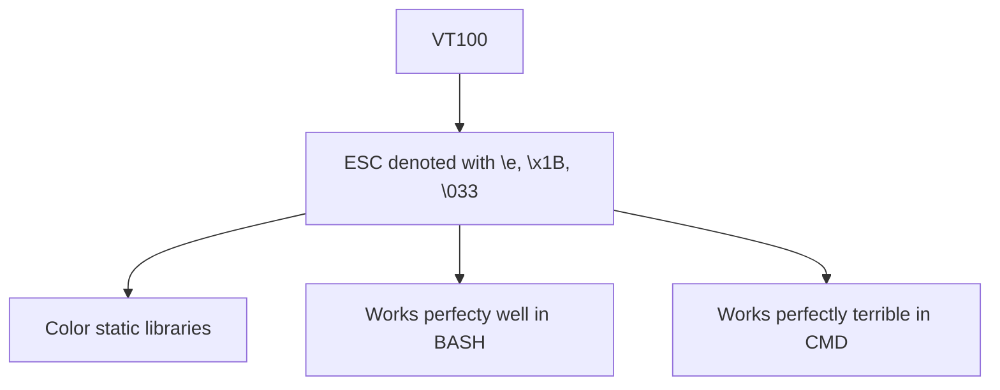

**Gitlab markdown codes**
https://docs.gitlab.com/ee/user/markdown.html

ANSI/VT100

[**Description of VT100**](https://misc.flogisoft.com/bash/tip_colors_and_formatting)

[**Official terminals website**](https://vt100.net)

**Color combinations**
>>>
\e[{**FORMAT_ATTRIBUTE**};{**FORGROUND_COLOR**};{**BACKGROUND_COLOR**}m

{**TEXT**}

\e[{**RESET_FORMATE_ATTRIBUTE**}m
>>>

**FORMAT ATTRIBUTE**
>>>
 { "Default", "0" },
 { "Bold", "1" },
 { "Dim", "2" },
 { "Italics", "3"},
 { "Underlined", "4" },
 { "Blink", "5" },
 { "Reverse", "7" },
 { "Hidden", "8" }
>>>
**FORGROUND COLOR**
>>>
 { "Default", "39" },
 { "Black", "30" },
 { "Red", "31" },
 { "Green", "32" },
 { "Yellow", "33" },
 { "Blue", "34" },
 { "Magenta", "35" },
 { "Cyan", "36" },
 { "Light Gray", "37" },
 { "Dark Gray", "90" },
 { "Light Red", "91" },
 { "Light Green", "92" },
 { "Light Yellow", "93" },
 { "Light Blue", "94" },
 { "Light Magenta", "95" },
 { "Light Cyan", "96" },
 { "White", "97" }
>>>
**BACKGROUND COLOR**
>>>
 { "Default", "49" },
 { "Black", "40" },
 { "Red", "41" },
 { "Green", "42" },
 { "Yellow", "43" },
 { "Blue", "44" },
 { "Megenta", "45" },
 { "Cyan", "46" },
 { "Light Gray", "47" },
 { "Dark Gray", "100" },
 { "Light Red", "101" },
 { "Light Green", "102" },
 { "Light Yellow", "103" },
 { "Light Blue", "104" },
 { "Light Magenta", "105" },
 { "Light Cyan", "106" },
 { "White", "107" }
>>>
**RESET FORMAT ATTRIBUTE**
>>>
 { "All", "0" },
 { "Bold", "21" },
 { "Dim", "22" },
 { "Underlined", "24" },
 { "Blink", "25" },
 { "Reverse", "27" },
 { "Hidden", "28" }
>>>
[Example of color representations](https://gist.github.com/Prakasaka/219fe5695beeb4d6311583e79933a009)

[Discussion on Win32 VT100 support](https://stackoverflow.com/questions/16755142/how-to-make-win32-console-recognize-ansi-vt100-escape-sequences)

[Example of implementing VT100 support on Windows 10 and higher](https://solarianprogrammer.com/2019/04/08/c-programming-ansi-escape-codes-windows-macos-linux-terminals/)

[Why VT100 support on Windows sucks](https://stackoverflow.com/questions/51680709/colored-text-output-in-powershell-console-using-ansi-vt100-codes)
